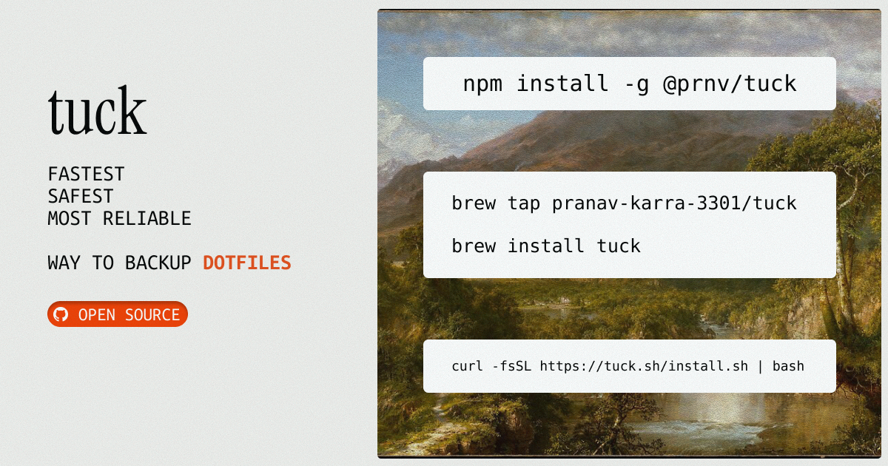

<div align="center">
  
  
  # tuck
  
  **The modern dotfiles manager**
  
  Simple, fast, and beautiful. Manage your dotfiles with Git, sync across machines, and never lose your configs again.

[](https://www.npmjs.com/package/@prnv/tuck)
[](https://opensource.org/licenses/MIT)
[](https://github.com/Pranav-Karra-3301/tuck/actions/workflows/ci.yml)

[Website](https://tuck.sh) · [Install](#installation) · [Quick Start](#quick-start) · [Commands](#commands)



</div>

---

## Why tuck?

- **One command to rule them all** — `tuck init` scans your system, lets you pick what to track, and syncs to your remote
- **Multi-provider support** — GitHub, GitLab (including self-hosted), local-only, or any custom git remote
- **Smart detection** — Auto-categorizes dotfiles (shell, git, editors, terminal, ssh, etc.)
- **Beautiful CLI** — Gorgeous prompts, spinners, and progress bars powered by @clack/prompts
- **Safe by default** — Creates backups before every operation, never overwrites without asking
- **Git-native** — Uses Git under the hood but hides the complexity
- **Cross-platform** — Works on macOS and Linux

## Installation

```bash
# npm
npm install -g @prnv/tuck

# Homebrew (macOS/Linux)
brew install prnv/tap/tuck

# pnpm
pnpm add -g @prnv/tuck

# yarn
yarn global add @prnv/tuck
```

## Quick Start

### First time setup

```bash
# Interactive setup - scans your system, pick what to track, syncs to GitHub
tuck init
```

That's it! `tuck init` does everything:

1. **Asks where to store** — GitHub, GitLab, local-only, or custom remote
2. Creates `~/.tuck` repository
3. Scans your system for dotfiles
4. Lets you select which to track
5. Creates a remote repo (if using GitHub/GitLab)
6. Commits and pushes

### Ongoing workflow

```bash
# Detect changes, find new dotfiles, commit, and push - all in one
tuck sync
```

### On a new machine

```bash
# Apply dotfiles from any GitHub user
tuck apply username

# Or clone your own and restore
tuck init --from github.com/you/dotfiles
tuck restore --all
```

## Commands

### Essential (what you'll use 99% of the time)

| Command       | Description                                                             |
| ------------- | ----------------------------------------------------------------------- |
| `tuck init`   | Set up tuck - scans for dotfiles, select what to track, syncs to GitHub |
| `tuck sync`   | Detect changes + new files, commit, and push (pulls first if behind)    |
| `tuck status` | See what's tracked, what's changed, and sync status                     |

### Managing Files

| Command               | Description                        |
| --------------------- | ---------------------------------- |
| `tuck add <paths>`    | Manually track specific files      |
| `tuck remove <paths>` | Stop tracking files                |
| `tuck scan`           | Discover dotfiles without syncing  |
| `tuck list`           | List all tracked files by category |
| `tuck diff [file]`    | Show what's changed                |

### Syncing

| Command     | Description      |
| ----------- | ---------------- |
| `tuck push` | Push to remote   |
| `tuck pull` | Pull from remote |

### Restoring

| Command             | Description                                            |
| ------------------- | ------------------------------------------------------ |
| `tuck apply <user>` | Apply dotfiles from a GitHub user (with smart merging) |
| `tuck restore`      | Restore dotfiles from repo to system                   |
| `tuck undo`         | Restore from Time Machine backup snapshots             |

### Configuration

| Command              | Description                                  |
| -------------------- | -------------------------------------------- |
| `tuck config`        | View/edit configuration                      |
| `tuck config remote` | Configure git provider (GitHub/GitLab/local) |
| `tuck config wizard` | Interactive configuration setup              |

## How It Works

tuck stores your dotfiles in `~/.tuck`, organized by category:

```
~/.tuck/
├── files/
│   ├── shell/      # .zshrc, .bashrc, .profile
│   ├── git/        # .gitconfig, .gitignore_global
│   ├── editors/    # .vimrc, nvim, VS Code settings
│   ├── terminal/   # .tmux.conf, alacritty, kitty
│   ├── ssh/        # ssh config (never keys!)
│   └── misc/       # everything else
├── .tuckmanifest.json
└── .tuckrc.json
```

**The flow:**

```
~/.zshrc          →  ~/.tuck/files/shell/zshrc
~/.gitconfig      →  ~/.tuck/files/git/gitconfig
~/.config/nvim    →  ~/.tuck/files/editors/nvim
```

Run `tuck sync` anytime to detect changes and push. On a new machine, run `tuck apply username` to grab anyone's dotfiles.

## Git Providers

tuck supports multiple git hosting providers, detected automatically during setup:

| Provider | CLI Required | Features |
|----------|--------------|----------|
| **GitHub** | `gh` | Auto-create repos, full integration |
| **GitLab** | `glab` | Auto-create repos, self-hosted support |
| **Local** | None | No remote sync, local git only |
| **Custom** | None | Any git URL (Bitbucket, Gitea, etc.) |

### Switching Providers

```bash
# Change provider anytime
tuck config remote

# Or via interactive config menu
tuck config
# → Select "Configure remote"
```

### Self-Hosted GitLab

tuck supports self-hosted GitLab instances:

```bash
tuck init
# → Select GitLab
# → Select "Self-hosted"
# → Enter your GitLab host (e.g., gitlab.company.com)
```

## Configuration

Configure tuck via `~/.tuck/.tuckrc.json` or `tuck config wizard`:

```json
{
  "repository": {
    "autoCommit": true,
    "autoPush": false
  },
  "files": {
    "strategy": "copy",
    "backupOnRestore": true
  },
  "remote": {
    "mode": "github",
    "username": "your-username"
  }
}
```

### File Strategies

- **copy** (default) — Files are copied. Run `tuck sync` to update the repo.
- **symlink** — Files are symlinked. Changes are instant but require more care.

## Security

tuck is designed with security in mind:

- **Never tracks private keys** — SSH keys, `.env` files, and credentials are blocked by default
- **Secret scanning** — Warns if files contain API keys or tokens
- **Placeholder support** — Replace secrets with `{{PLACEHOLDER}}` syntax
- **Local secrets** — Store actual values in `secrets.local.json` (never committed)

```bash
# Scan tracked files for secrets
tuck secrets scan

# Set a secret value locally
tuck secrets set API_KEY "your-actual-key"
```

## Hooks

Run custom commands before/after operations:

```json
{
  "hooks": {
    "postRestore": "source ~/.zshrc"
  }
}
```

## Development

```bash
git clone https://github.com/Pranav-Karra-3301/tuck.git
cd tuck
pnpm install
pnpm build
pnpm test
```

## Contributing

Contributions are welcome! Please read our contributing guidelines and submit PRs to the `main` branch.

## License

MIT — see [LICENSE](LICENSE)

---

<div align="center">
  <sub>Made with love in San Francisco and State College</sub>
</div>
