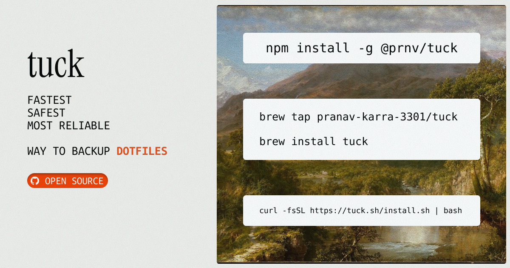

<div align="center">
  
  
  # tuck
  
  **The modern dotfiles manager**
  
  Simple, fast, and beautiful. Manage your dotfiles with Git, sync across machines, and never lose your configs again.

[](https://www.npmjs.com/package/@prnv/tuck)
[](https://opensource.org/licenses/MIT)
[](https://github.com/Pranav-Karra-3301/tuck/actions/workflows/ci.yml)

[Website](https://tuck.sh) · [Install](#installation) · [Quick Start](#quick-start) · [Commands](#commands)



</div>

---

## Why tuck?

- **One command to rule them all** — `tuck init` scans your system, lets you pick what to track, and syncs to your remote
- **Multi-provider support** — GitHub, GitLab (including self-hosted), local-only, or any custom git remote
- **Smart detection** — Auto-categorizes dotfiles (shell, git, editors, terminal, ssh, etc.)
- **Beautiful CLI** — Gorgeous prompts, spinners, and progress bars powered by @clack/prompts
- **Safe by default** — Creates backups before every operation, never overwrites without asking
- **Git-native** — Uses Git under the hood but hides the complexity
- **Cross-platform** — Works on macOS, Linux, and Windows

## Installation

```bash
# npm (all platforms)
npm install -g @prnv/tuck

# Homebrew (macOS/Linux) - coming soon
brew install pranav-karra-3301/tap/tuck

# pnpm (all platforms)
pnpm add -g @prnv/tuck

# yarn (all platforms)
yarn global add @prnv/tuck

# Windows (PowerShell)
npm install -g @prnv/tuck
# Or download the binary from GitHub Releases
```

## Quick Start

### First time setup

```bash
# Interactive setup - scans your system, pick what to track, syncs to GitHub
tuck init
```

That's it! `tuck init` does everything:

1. **Asks where to store** — GitHub, GitLab, local-only, or custom remote
2. Creates `~/.tuck` repository
3. Scans your system for dotfiles
4. Lets you select which to track
5. Creates a remote repo (if using GitHub/GitLab)
6. Commits and pushes

### Ongoing workflow

```bash
# Detect changes, find new dotfiles, commit, and push - all in one
tuck sync
```

### On a new machine

```bash
# One command sets up the whole machine: install packages, apply dotfiles,
# run health checks — idempotent, so re-running just converges.
tuck bootstrap username

# Or install tuck AND bootstrap in a single curl (no tuck required yet):
curl -fsSL https://raw.githubusercontent.com/Pranav-Karra-3301/tuck/main/install.sh | bash -s -- username --yes

# Just the dotfiles (no packages, no doctor):
tuck apply username

# Or clone your own and restore
tuck init --from github.com/you/dotfiles
tuck restore --all
```

### Onto a remote box (SSH)

Push the configs this machine already tracks — your agent configs (`.claude`,
`.cursor`, `.codex`), shell, git, editor — onto a remote server over ssh/scp.
tuck prints a plan first and asks before transferring anything.

```bash
# Push everything you track to a remote box (a plan is shown first)
tuck apply --target ssh://me@server.example.com

# Shorthand, a non-standard port, and a preview-only run
tuck apply --ssh me@server.example.com --port 2222
tuck apply --ssh server --dry-run

# Only push a single bundle (e.g. your agent configs)
tuck apply --ssh server --bundle agents
```

Each tracked file lands at the same home-relative path on the remote
(`~/.zshrc` → remote `~/.zshrc`). Only regular home-scoped files are pushed;
repo-scoped and directory entries are skipped and reported. Nothing runs through
a shell on your side, and the ssh host/user/port and every remote path are
validated before use.

**No local push? Bootstrap the remote instead.** Print a one-liner that installs
tuck and applies a source on a fresh box:

```bash
tuck apply you/dotfiles --print-bootstrap
# → npm install -g @prnv/tuck && tuck apply you/dotfiles --yes
# run it over ssh:
ssh server 'npm install -g @prnv/tuck && tuck apply you/dotfiles --yes'
```

Requires `ssh` and `scp` on your machine and SSH access to the remote (key-based
auth recommended). `tuck` does not need to be installed on the remote for a push.

## Commands

### Essential (what you'll use 99% of the time)

| Command       | Description                                                             |
| ------------- | ----------------------------------------------------------------------- |
| `tuck init`   | Set up tuck - scans for dotfiles, select what to track, syncs to GitHub |
| `tuck sync`   | Detect changes + new files, commit, and push (pulls first if behind)    |
| `tuck status` | See what's tracked, what's changed, and sync status                     |

### Managing Files

| Command                     | Description                                           |
| --------------------------- | ----------------------------------------------------- |
| `tuck add <paths>`          | Manually track specific files                         |
| `tuck add --preset <agent>` | Track an AI agent's safe config allowlist (see below) |
| `tuck remove <paths>`       | Stop tracking files                                   |
| `tuck scan`                 | Discover dotfiles without syncing                     |
| `tuck list`                 | List all tracked files by category                    |
| `tuck diff [file]`          | Show what's changed                                   |

### Syncing

| Command     | Description      |
| ----------- | ---------------- |
| `tuck push` | Push to remote   |
| `tuck pull` | Pull from remote |

### Restoring

| Command                     | Description                                                                          |
| --------------------------- | ------------------------------------------------------------------------------------ |
| `tuck bootstrap <repo>`     | One-command machine setup: install packages, apply dotfiles, run doctor (idempotent) |
| `tuck apply <user>`         | Apply dotfiles from a GitHub user (with smart merging)                               |
| `tuck apply --target <uri>` | Push your locally-tracked configs onto a remote box over SSH                         |
| `tuck restore`              | Restore dotfiles from repo to system                                                 |
| `tuck undo`                 | Restore from Time Machine backup snapshots                                           |

`tuck bootstrap` flags:
- `--yes` / `--force`: Non-interactive (skip the plan confirmation)
- `--dry-run`: Show the plan and what would change without touching the machine
- `--skip-packages`: Apply dotfiles only, don't install declared packages
- `--skip-doctor`: Skip the final health check
- `-m, --merge` / `-r, --replace`: Conflict strategy for existing files (merge is the default)
- `-b, --bundle <name>`: Only bootstrap files in the named bundle
- `--json`: Emit a single machine-readable envelope

#### Declarative dependencies (`requires:`)

Tracked files can declare the packages they need with `<manager>:<package>` specs.
`tuck bootstrap` installs them (topologically ordered, packages before files) and
shows the plan first. Installation is idempotent — already-present packages are
detected and skipped, and a package manager that isn't available is skipped, not
fatal.

```bash
# Record dependencies when tracking a file
tuck add ~/.zshrc --requires "brew:starship,apt:zsh"

# Bootstrap installs starship/zsh (as available) before applying ~/.zshrc
tuck bootstrap you/dotfiles --yes
```

Supported managers: `brew`, `apt`, `dnf`, `pacman`, `winget`, `scoop`, `cargo`, `npm`, `pnpm`, `pipx`, `go`, `gem`.
### Configuration

| Command                               | Description                                              |
| ------------------------------------- | -------------------------------------------------------- |
| `tuck config`                         | Interactive config menu (includes a setup wizard option) |
| `tuck config remote`                  | Configure git provider (GitHub/GitLab/local)             |
| `tuck config get/set/list/edit/reset` | Read or change individual settings                       |

### Diagnostics & Verification

| Command       | Description                                                                       |
| ------------- | --------------------------------------------------------------------------------- |
| `tuck doctor` | Run repository health and safety diagnostics                                      |
| `tuck verify` | Verify the live system, repo, and manifest agree (add `--exit-code` as a CI gate) |

`tuck doctor` flags:

- `--json`: Machine-readable output for CI
- `--strict`: Treat warnings as non-zero exit
- `-c, --category <env|repo|manifest|security|hooks|sandboxing>`: Run one check group

### Advanced

| Command             | Description                                                       |
| ------------------- | ---------------------------------------------------------------- |
| `tuck bundle`       | Manage bundles — logical groups of tracked files                 |
| `tuck profile`      | Profiles / tags — apply work/personal/server/agent subsets       |
| `tuck encryption`   | Manage at-rest backup encryption (AES-256-GCM, password-based)   |
| `tuck secrets`      | Manage local secrets / placeholder replacement                   |
| `tuck context`      | Track AI agent configs across home and per-repo scopes           |
| `tuck preset`       | Apply or publish curated bundles of dotfiles & agent configs     |
| `tuck repo`         | Manage machine-local repo bindings (for repo-scoped tracking)    |
| `tuck mcp`          | Run the MCP server + manage your MCP fleet (define once, render per client) |

### MCP fleet — define servers once, render per client

MCP client config formats diverge: Claude Desktop uses one JSON shape, Cursor
another, VS Code a third. Declare each MCP server once in your tuck repo and let
`tuck mcp apply` project it into every client's native format, injecting
credentials from your secret backends at apply time.

```bash
# Declare a server once (credentials stay as {{PLACEHOLDER}} references)
tuck mcp add github \
  --command npx \
  --arg -y --arg @modelcontextprotocol/server-github \
  --env GITHUB_TOKEN={{GITHUB_TOKEN}}

# A remote (http/sse) server, scoped to specific clients
tuck mcp add linear --transport sse --url https://mcp.linear.app/sse --client cursor --client vscode

tuck mcp list                 # show the fleet
tuck mcp clients              # supported clients + their config paths
tuck mcp render --client cursor   # preview (secrets NOT injected by default)
tuck mcp apply --dry-run      # show what would change
tuck mcp apply                # write configs (backs up existing files first)
```

The fleet lives in `mcp-servers.json` in your tuck repo and is safe to commit —
it only ever holds placeholders, never real secrets. On apply, `{{PLACEHOLDER}}`
values are resolved from the same secret backends tuck uses for dotfiles; if any
can't be resolved, apply refuses to write rather than leak an unresolved token.
Supported clients: Claude Desktop, Claude Code, Cursor, Windsurf, VS Code.


## How It Works

tuck stores your dotfiles in `~/.tuck`, organized by category:

```
~/.tuck/
├── files/
│   ├── shell/      # .zshrc, .bashrc, .profile
│   ├── git/        # .gitconfig, .gitignore_global
│   ├── editors/    # .vimrc, nvim, VS Code settings
│   ├── terminal/   # .tmux.conf, alacritty, kitty
│   ├── ssh/        # ssh config (never keys!)
│   └── misc/       # everything else
├── .tuckmanifest.json
└── .tuckrc.json
```

**The flow:**

```
~/.zshrc          →  ~/.tuck/files/shell/zshrc
~/.gitconfig      →  ~/.tuck/files/git/gitconfig
~/.config/nvim    →  ~/.tuck/files/editors/nvim
```

Run `tuck sync` anytime to detect changes and push. On a new machine, run `tuck apply username` to grab anyone's dotfiles.

## Profiles (work / personal / server / agent)

One repo, different machines. Tag any tracked file with one or more **profiles**,
then apply just the subset a machine needs. A file with **no tags** is
**universal** — it applies under every profile (your shared/common set).

```bash
# Tag files as you track them…
tuck add ~/.work-gitconfig --tag work
tuck add ~/.claude --tag agent

# …or tag existing files later
tuck profile tag personal ~/.hammerspoon

# See profiles, counts, and this machine's binding
tuck profile list

# Apply only a subset
tuck apply you/dotfiles --profile work        # universal + work
```

**Remembered per machine.** Bind a machine once and `tuck apply` uses that
profile by default (the binding is machine-local and never committed):

```bash
tuck profile bind work
tuck apply you/dotfiles        # applies the "work" subset automatically
```

`tuck status` shows the bound profile and **flags cross-profile leaks** — files
belonging to other profiles that ended up on this machine.

### Ephemeral environments (devcontainers, Codespaces, agent sandboxes)

Nobody wants their whole dotfiles — or their credentials — in every throwaway
sandbox. Tag just your agent configs and apply that subset headlessly:

```bash
tuck profile create agent
tuck profile tag agent ~/.claude ~/.codex

# Scaffold a devcontainer.json + Codespaces dotfiles bootstrap
tuck profile devcontainer .
```

The generated `.devcontainer/devcontainer.json` and `install.sh` run:

```bash
tuck apply you/dotfiles --profile agent --yes
```

so only the agent-config subset lands in the container — no secrets, no
personal or work files.

| Command                          | Description                                            |
| -------------------------------- | ------------------------------------------------------ |
| `tuck profile list`              | List profiles, file counts, and the bound profile      |
| `tuck profile create <name>`     | Register a new profile                                  |
| `tuck profile rm <name>`         | Remove a profile (strips its tag from files)           |
| `tuck profile tag <p> <path…>`   | Tag tracked file(s) with a profile                     |
| `tuck profile untag <p> <path…>` | Remove a profile tag from tracked file(s)              |
| `tuck profile bind <name>`       | Bind THIS machine to a profile (machine-local)         |
| `tuck profile unbind`            | Clear this machine's binding                           |
| `tuck profile show`              | Show the bound profile and any cross-profile leaks     |
| `tuck profile devcontainer [dir]`| Scaffold devcontainer.json + Codespaces bootstrap      |

## AI Agent Configs

tuck knows exactly which files under each AI agent's home directory are safe to
version-control — and which are credentials, history, or session state that must
never leave your machine. One command tracks the safe set:

```bash
tuck add --preset claude-code   # CLAUDE.md, settings.json, commands/, skills/, agents/, hooks/, rules/
tuck add --preset cursor        # user settings, keybindings, snippets, ~/.cursor rules
tuck add --preset codex         # AGENTS.md, config.toml, prompts/
tuck add --preset gemini        # GEMINI.md, settings.json, commands/
tuck add --preset copilot       # GitHub Copilot CLI config (non-credential)
```

Each preset **hard-excludes** local/credential/history/session files
(`settings.local.json`, `.credentials.json`, `sessions/`, `projects/`, …). Files
that are found but deliberately skipped are reported so you know they were left
alone, and tuck's secret scanner still runs on everything actually tracked.

Preview without tracking anything:

```bash
tuck add --preset claude-code --plan --json
```

### Cross-agent translation

Keep one canonical instructions file and materialize it for every agent you use.
`tuck preset translate` writes the same source into each agent's global
instruction path (default: Claude Code's `~/.claude/CLAUDE.md` and Codex's
`~/.codex/AGENTS.md`):

```bash
tuck preset translate ~/dotfiles/AGENTS.md          # copy into Claude + Codex
tuck preset translate ~/dotfiles/AGENTS.md --link   # symlink instead of copy
tuck preset translate ~/dotfiles/AGENTS.md --to claude-code,codex,gemini
```

Existing files are snapshotted before being overwritten (`tuck undo` rolls it
back), and translation refuses to clobber non-interactively without `--yes`.

## Git Providers

tuck supports multiple git hosting providers, detected automatically during setup:

| Provider   | CLI Required | Features                               |
| ---------- | ------------ | -------------------------------------- |
| **GitHub** | `gh`         | Auto-create repos, full integration    |
| **GitLab** | `glab`       | Auto-create repos, self-hosted support |
| **Local**  | None         | No remote sync, local git only         |
| **Custom** | None         | Any git URL (Bitbucket, Gitea, etc.)   |

### Switching Providers

```bash
# Change provider anytime
tuck config remote

# Or via interactive config menu
tuck config
# → Select "Configure remote"
```

### Self-Hosted GitLab

tuck supports self-hosted GitLab instances:

```bash
tuck init
# → Select GitLab
# → Select "Self-hosted"
# → Enter your GitLab host (e.g., gitlab.company.com)
```

## Configuration

Configure tuck via `~/.tuck/.tuckrc.json` or the interactive `tuck config` menu (which includes a setup wizard):

```json
{
  "repository": {
    "autoCommit": true,
    "autoPush": false
  },
  "files": {
    "strategy": "copy",
    "backupOnRestore": true
  },
  "remote": {
    "mode": "github",
    "username": "your-username"
  }
}
```

### File Strategies

- **copy** (default) — Files are copied. Run `tuck sync` to update the repo.
- **symlink** — tuck copies the file into the repo, then replaces the original path with a symlink to the repo file. Changes are instant, but this modifies your home dotfile paths.

## Windows Support

tuck fully supports Windows with platform-specific handling:

### Detected Windows Dotfiles

| Category     | Files                                                    |
| ------------ | -------------------------------------------------------- |
| **Shell**    | PowerShell profiles (`Microsoft.PowerShell_profile.ps1`) |
| **Terminal** | Windows Terminal settings, ConEmu/Cmder configs          |
| **Editors**  | VS Code, Cursor, Neovim (in `%LOCALAPPDATA%`)            |
| **Git**      | `.gitconfig`, `.gitignore_global`                        |
| **SSH**      | SSH config in `%USERPROFILE%\.ssh`                       |
| **Misc**     | WSL config (`.wslconfig`), Docker, Kubernetes            |

### Windows-Specific Behavior

- **Symlinks**: On Windows, tuck uses directory junctions (don't require admin privileges) or falls back to copying files
- **Permissions**: Unix-style file permissions (chmod) don't apply on Windows; tuck handles this gracefully
- **Paths**: Windows environment variables (`%APPDATA%`, `%LOCALAPPDATA%`, `%USERPROFILE%`) are automatically expanded
- **Hooks**: tuck uses PowerShell Core (`pwsh`) or Windows PowerShell for hook execution

### PowerShell Profile Merging

tuck supports smart merging for PowerShell profiles with preserve markers:

```powershell
# In your PowerShell profile, start a local-only section with a marker.
# The block runs from the marker until the next blank line followed by a
# non-indented, non-comment line (or end of file) — there is no closing marker.
<# tuck:preserve #>
# Machine-specific aliases
Set-Alias code "C:\Program Files\Microsoft VS Code\Code.exe"

# Everything above the blank line + this comment/statement is preserved.
```

The marker (`<# tuck:preserve #>`, also `<# tuck:keep #>` / `<# tuck:local #>`)
**opens** a preserved region; tuck ends the region at the first blank line that
is followed by a non-indented, non-comment line, or at end of file. Do not add a
`<# /tuck:preserve #>`-style closing marker — tuck does not recognize one, and it
would be swept into the preserved block as ordinary content.

## Security

tuck is designed with security in mind:

- **Never tracks private keys** — SSH keys, `.env` files, and credentials are blocked by default
- **Secret scanning** — Warns if files contain API keys or tokens
- **Placeholder support** — Replace secrets with `{{PLACEHOLDER}}` syntax
- **External-first secrets** — `security.secretBackend` defaults to `auto`, preferring external password managers before local fallback
- **Local fallback secrets** — Store actual values in `secrets.local.json` when needed; it is gitignored by default
- **Runtime state isolation** — Audit logs, snapshots, and fallback keystore data live outside the tracked tuck repo

```bash
# Scan tracked files for secrets
tuck secrets scan

# Set a secret value locally
tuck secrets set API_KEY
```

### MCP secrets extraction

MCP clients (Claude Desktop, Claude Code, Cursor, VS Code) often store API keys
and tokens as plaintext inside `mcpServers[...].env` blocks. `tuck secrets
extract` rewrites those inline credentials into placeholders and stores the real
values in your configured secret backend, so nothing sensitive is committed:

```bash
# Scan known MCP config files, preview changes, then extract
tuck secrets extract --mcp --dry-run
tuck secrets extract --mcp

# Or target specific files, and use client-native ${env:NAME} references
tuck secrets extract ./.cursor/mcp.json --format env
```

Known locations that `--mcp` inspects: Claude Desktop (`claude_desktop_config.json`),
`~/.claude.json`, `~/.cursor/mcp.json`, `~/.mcp.json`, `.mcp.json` / `mcp.json`
(project), and `.vscode/mcp.json`. A pre-change snapshot is always taken (revert
with `tuck undo`). With the default `--format placeholder`, `tuck apply`
re-injects the values from the backend on each machine; with `--format env` you
export the matching env vars yourself.

## Hooks

Run custom commands before/after operations:

```json
{
  "hooks": {
    "postRestore": "source ~/.zshrc"
  }
}
```

## Development

```bash
git clone https://github.com/Pranav-Karra-3301/tuck.git
cd tuck
pnpm install
pnpm build
pnpm test
```

## Contributing

Contributions are welcome! Please read our contributing guidelines and submit PRs to the `main` branch.

## License

MIT — see [LICENSE](LICENSE)

---

<div align="center">
  <sub>Made with love in San Francisco and State College</sub>
</div>
